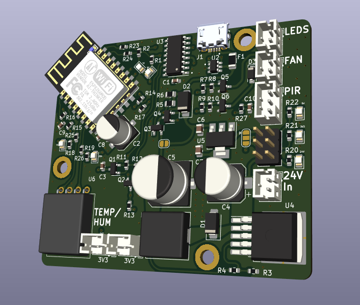
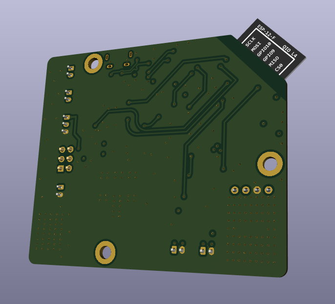
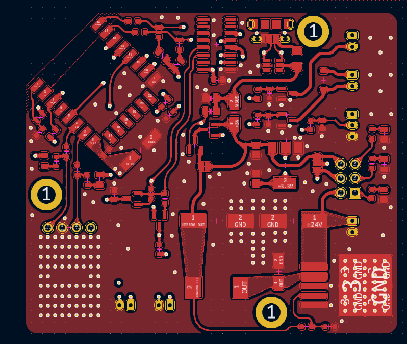
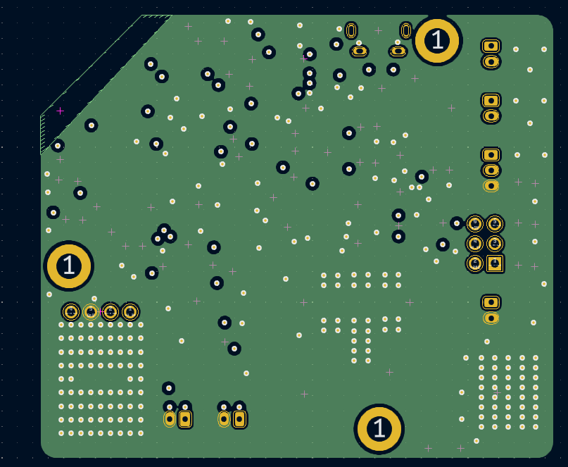
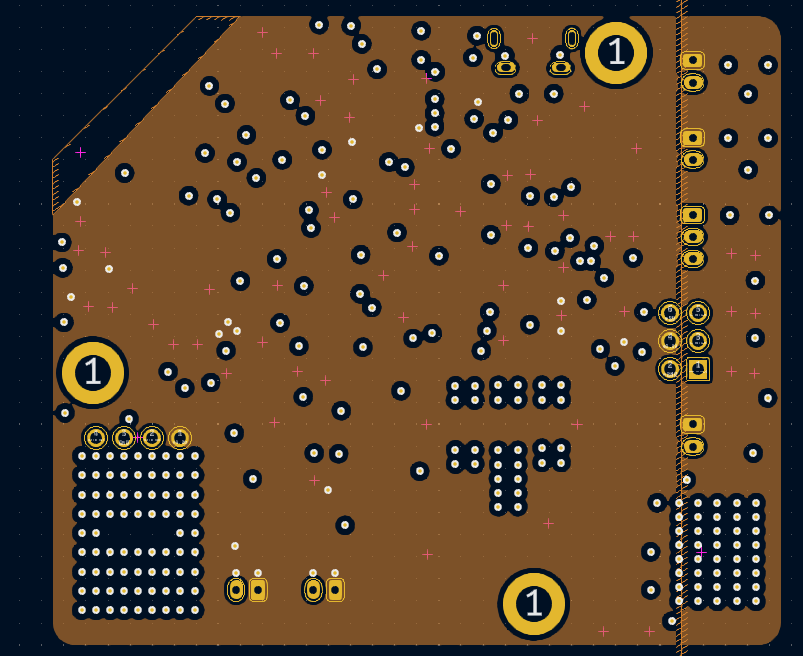
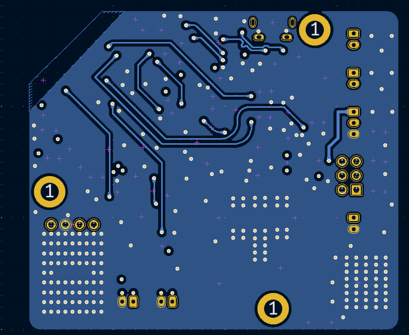

# ESP8266-based Fan Control for Bambu Lab A1 3D Printer

## Overview

This project showcases an ESP8266-based board designed to control an external fan to enhance nozzle and print cooling on the Bambu Lab A1 3D printer. The PCB consists of 4 layers in the stack-up: signals, ground, power, and signals.

**Note:** This project is a work in progress.

## Features

The board includes the following components:

- **ESP-12F module**: For wireless communication. The ESP-12F module allows the board to connect to a Wi-Fi network, enabling remote monitoring and control.
- **CH340C**: USB to UART converter for programming the ESP8266. It makes it easy to upload firmware updates or make changes to the program running on the ESP8266.
- **AM2320**: Digital temperature and humidity sensor. It provides accurate readings of the ambient temperature and humidity levels, which can be used to optimize the cooling process.
- **External LED connections**: To drive LEDs located on the printer. These LEDs can provide visual feedback, status indicators, or ambient lighting.
- **External fan connection**: For increased cooling. The fan helps enhance nozzle and print cooling, improving print quality by preventing overheating and warping.
- **PIR sensor connection**: Allows connecting a motion sensor to the board. It can detect motion and be used for various purposes, such as turning on the fan or LEDs when motion is detected near the printer.
- **Buck converter (LM2596)**: Used to step down the voltage from 24V to 5V. This is necessary because the printer's power supply typically provides 24V, but the board components require lower voltage levels to operate safely.
- **AMS1117**: Voltage regulator that further steps down the voltage from 5V to 3.3V, ensuring the ESP-12F module operates properly without being damaged.

## Images

Below are images of the PCB:

3D render of the front view of the PCB

3D render of the back view of the PCB

Front view of the actual PCB

Ground layer of the PCB stack-up

Power layer of the PCB stack-up

Back view of the actual PCB

## Schematics

For detailed schematics, please refer to the [schematic PDF](imgs/schematic.pdf).
